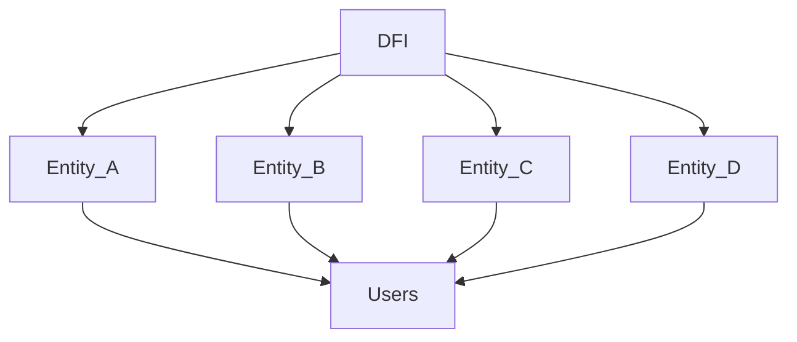

# Blueprint

DFI integrates documentation into developers existing workflows, so writing, maintaining, and finding documentation is effortless.

#### Organigram

Base platform DFI is installing infrastructure for its sub members (DAOs) providing services to them. Sub DAOs acquire users for their community with services of base platform DFI.

#### Entity Principle

Each entity is representing an organization, consuming products and services of its mother platform DFI...
