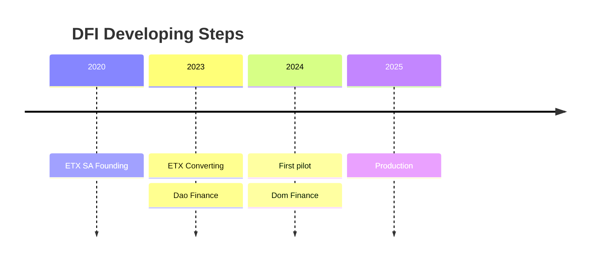
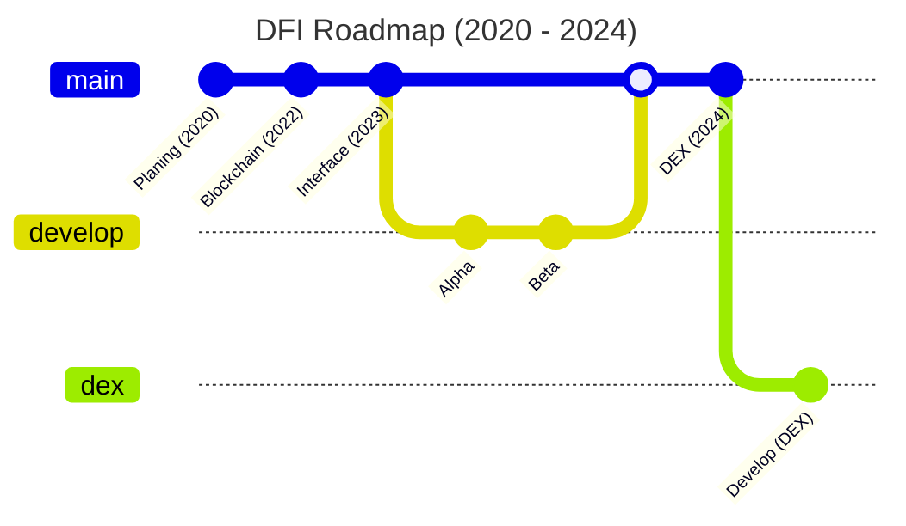

# Introduction

DAO Finance is a simple, open-source framework. It was popularized due to its minimum viable DAO design and the advent of rage-quit - that means for its members to exit DAO by exchanging their shares.

### Organization Timeline

In 2020, we started DAOFINANCE with a vision to change the world's relationship with money for the better. A decade and 8 million code lines later, our goal is still the same — to give you the freedom to bank your way. Banking designed to empower you!

### Be part of new-wave finance (Roadmap)

Dao Finance as a next-generation decentralized organization that coordinates the resources of a community (human and capital) to sustainably deliver value for its members and users.

### Platform for nextgen finance

Grow and protect your wealth with a secure, multi-currency account on a decentralized, zero-trust platform with its own private chain. This is unique in its kind.

### What is it for?

**Secure, private banking**\
Protect, access and grow your wealth globally with a smart, on-chain private bank account. You are free to transact in EUR, GBP, USD. Buy, manage and hold Stablecoins, Bitcoin, Ethereum, etc. privately and anonymously with a preferred wallet of your trust, and still be able to convert or use them all like any FIAT.

**Global payments**\
Make cross-border payments seamless, anonymously and easy. Send, receive, and transact Stablecoins and FIAT EUR, GBP, USD with minimal fees and no hidden costs, and/or instantly convert them to your preferred cryptocurrency.

**Secure crypto account**\
Grow your Bitcoin, Ethereum, etc. with annual interest, paid out daily, and enjoy access to the DAO Finance Private Network — one of the fastest, anonymous and cheapest ways to send cryptocurrencies.

**Crypto payments made easy**\
Take advantage of our global crypto payment gateway made easy and accessible for everyone — whether you're a business owner, crypto user, or even from another planet. Connect your business with a unique payment platform. Developer-friendly tools that are easy to use and understand for software developers. Typically, intuitive user interfaces, helpful documentation, and good support options to grow your business on demand.

-   Built by developers for developers
-   Carefully crafted code for API

**Portfolio Management**\
Portfolio management in its art and science of selecting and overseeing a group of investments that meet the long-term financial objectives and risk tolerance, chosen by you.

**Open Source**\
Since build with/on compressive DAO Finance framework is an open-source project we wanted to continue this movement too.

Built on top of bunch smart contracts. Smart contract code undergoes testing and validation before deployment and all transactions are recorded on a public ledger \[Blockchain]. This makes them less vulnerable to malicious attacks and fraud.

#### DFI (Dao Finance) is a DAO

DAO for a banking is able to offer secure and efficient services without the need for a brick-and-mortar infrastructure, relying instead on DLT (Blockchain). Welcome to the future of banking — beautifully simple, 100% transparent, and built trustfully on EVM-powered blockchain technology with its member's privacy in mind.
